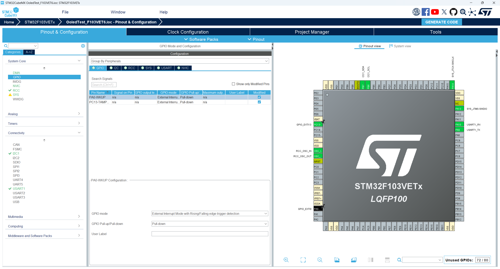
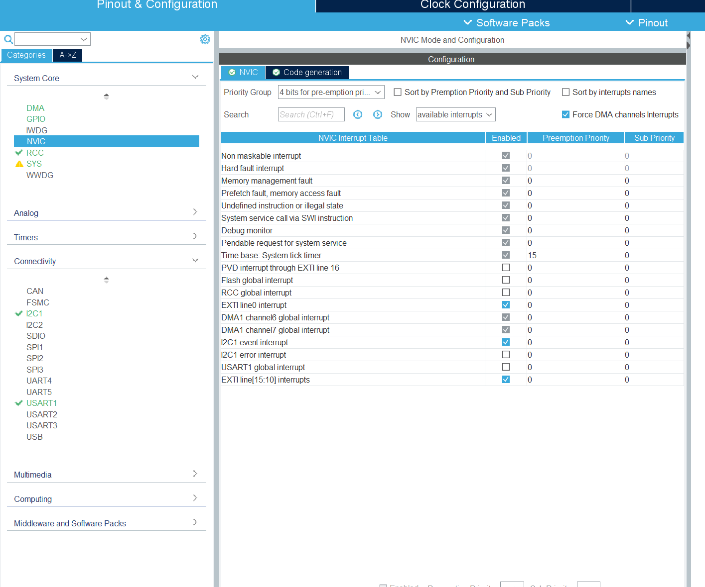
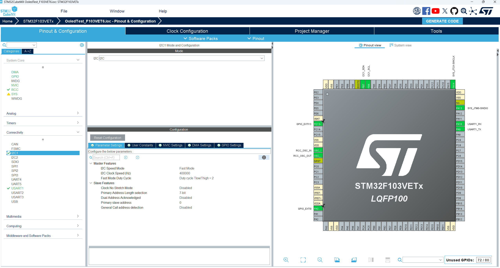
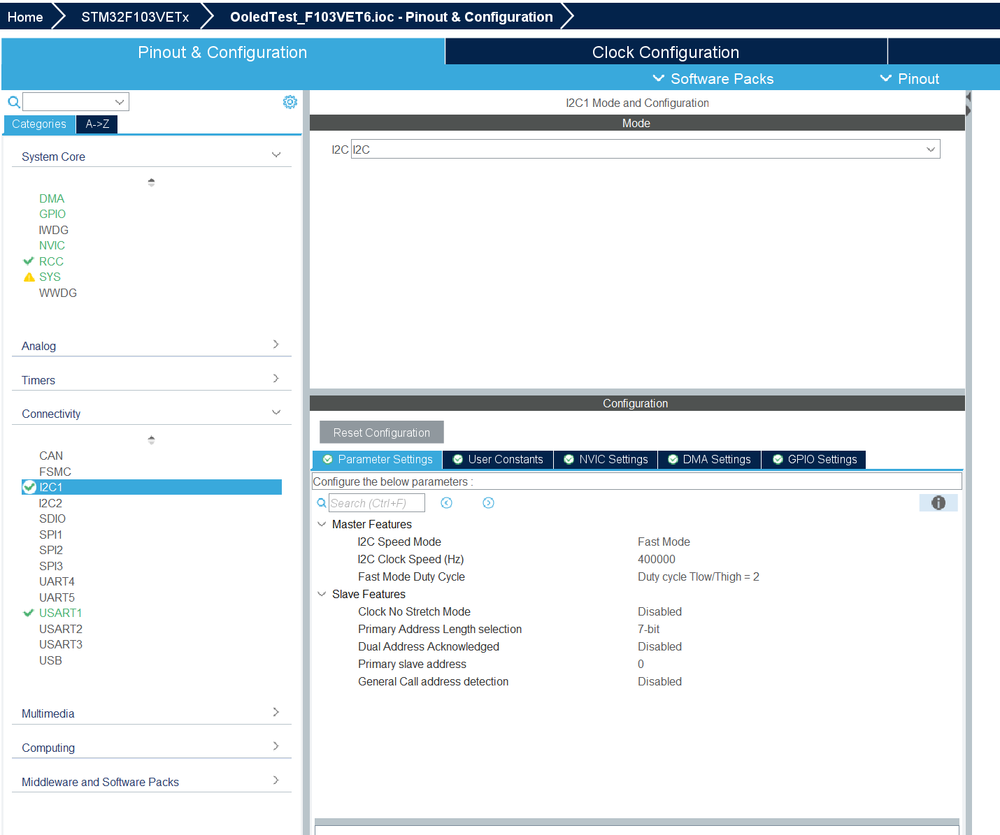
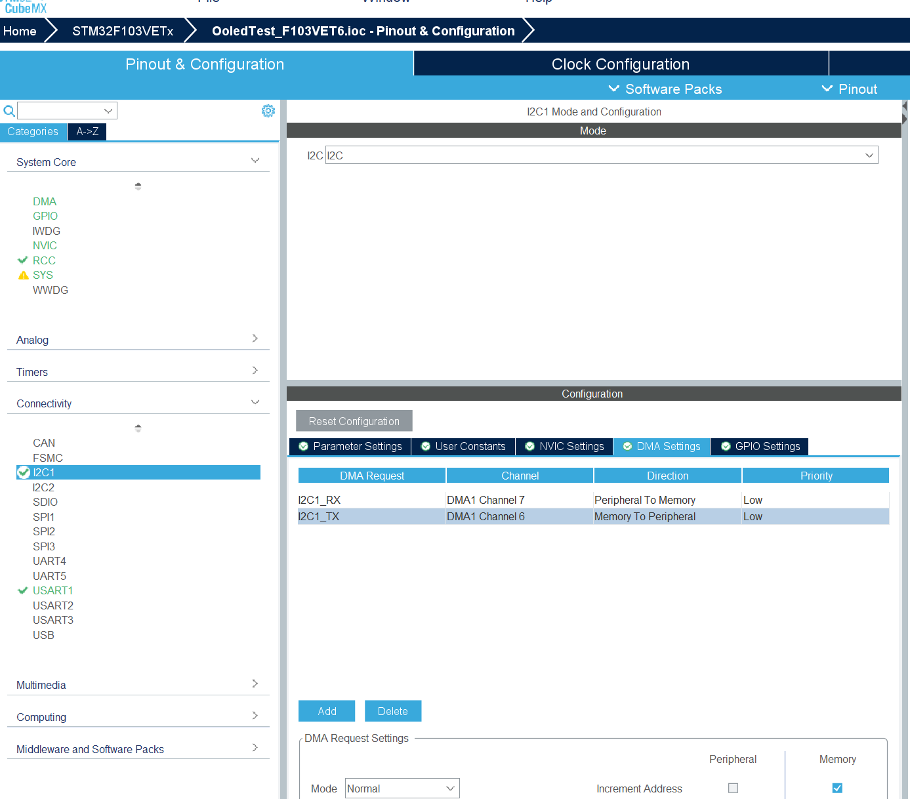

# OLED Menu System for STM32

[](https://opensource.org/licenses/MIT)

OLED多级菜单系统，支持动态动画效果和多种交互控件，适用于嵌入式设备的用户界面开发

菜单默认使用 ASCII 字体绘制；底层绘制接口已包含 UTF-8 字库支持，可按需接入中文菜单项。

视频介绍：

https://www.bilibili.com/video/BV1y7NYeMELy/?spm_id_from=333.1387.homepage.video_card.click&vd_source=db23359a52cb1ccca808fd2611658f09

问题整理:
  - 两个按键gpio的中断需要上升沿和下降沿都触发中断！
  - 菜单和菜单项使用静态池，默认 `MENU_MAX_MENUS` 为 8，`MENU_MAX_ITEMS` 为 16，可在 `oled_menu_types.h` 中调整
  - 在 FreeRTOS 中使用时，可通过 `Menu_SetPlatform()` 将延时函数替换为 `osDelay`
  - 如果需要翻转屏幕，在`OLED_Init()`中有详细配置，可以根据注释结合自己的需求更改

---

## 功能特性

- **多级菜单支持**：灵活嵌套的树形菜单结构
- **平滑动画过渡**：菜单切换和控件操作均支持缓动动画
- **丰富控件类型**：
  - 开关控件（ON/OFF）
  - 数值显示控件
  - 滑动条控件
- **智能滚动条**：根据菜单项数量自适应调整
- **按键响应优化**：支持长短按区分处理
- **静态内存池**：菜单和菜单项不依赖运行期堆扩容，适配资源受限设备
- **事件接口**：支持将按键、编码器等输入转换为 `MenuEventTypedef`

---

## 硬件依赖

- MCU：STM32（需支持HAL库）
- 显示屏：128x64 OLED（SSD1306驱动）
- 输入：两个物理按键（左/右方向）

---

## 快速开始

### 1. 移植驱动
将以下文件添加到工程：

`oled_menu.h` `oled_draw.h` `oled_menu_types.h` `font.h`移植到Inc文件夹

`oled_menu.c` `oled_draw.c` `font.c`移植到Src文件夹

### 2. CubeMX配置

GPIO配置


中断配置


i2c配置





### 3. 按键配置
在`oled_menu.h`中修改GPIO定义：
```c
#define RIGHT_KEY_GPIOX    GPIOC
#define RIGHT_KEY_GPIO_PIN GPIO_PIN_8
#define LEFT_KEY_GPIOX     GPIOC
#define LEFT_KEY_GPIO_PIN  GPIO_PIN_9
```
并且需要开启两个按键gpio的中断
且需要上升沿和下降沿都触发中断！

### 4. OLED_Send()函数配置
在`oled_draw.c`中的OLED_Send是移植本项目时的重要函数

```c
void OLED_Send(uint8_t *data, uint8_t len)
{
  /* 默认实现使用 DMA，并等待 I2C 回到 READY，避免发送缓冲区被提前复用。 */
}
```

默认使用stm32 i2c+DMA（建议在cubemx中配置i2c为高速模式）, 如有其他i2c或spi需要请自行更改


### 5. api调用

`AddMenu()`添加新菜单   `AddMenuItem()`添加菜单项

在初始化中调用   `UI_Init()`

在主循环中调用   `UI_UpDate()` `UI_Move()` `UI_Show()` 

如需绕过默认按键处理，可直接调用：

```c
Menu_HandleEvent(MENU_EVENT_NEXT);
Menu_HandleEvent(MENU_EVENT_PREV);
Menu_HandleEvent(MENU_EVENT_ENTER);
Menu_HandleEvent(MENU_EVENT_BACK);
```

更多重构和迁移说明见 `MIGRATION.md`。

具体使用见例程和视频
